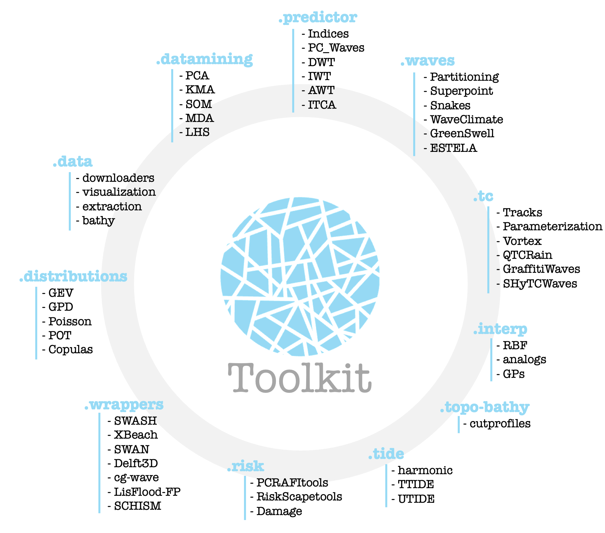

# Bluemath {**Toolkit**}

Module collection for custom climate data analysis. The main objective of this Python package is to provide a set of statistical tools tailored for climate data analysis, with a focus on statistical classification and prediction.

The package also includes a set of utility functions for processing climate data. To facilitate understanding of how to use these modules, simple demonstration scripts and the necessary data have been added to this repository.

## Main contents

Link to the different sections:
- [data](./codes/data/)
- [datamining](./codes/datamining/)
- [waves](./codes/waves/)
- [predictor](./codes/predictor/)
- [TC](./codes/TC/)
- [distributions](./codes/distributions/)
- [wrappers](./codes/wrappers/)
- [risk](./codes/risk/)
- [tide](./codes/tide/)

## Demos

In this repository, simple demo files showcasing the utilization of the different tools can be found in this [link](./demos). Furthermore, full examples with figures can be found in the [Bluemath - notebooks](./) repository.

## Authors

Codes have been developed through a collaborative effort by members of the GeoOcean group at the University of Cantabria. For inquiries, please contact Fernando Méndez at mendezf@unican.es

## License

This project is licensed under the MIT License. See the [license](LICENSE.txt) file for details

## Project status

- UNDER DEVELOPMENT